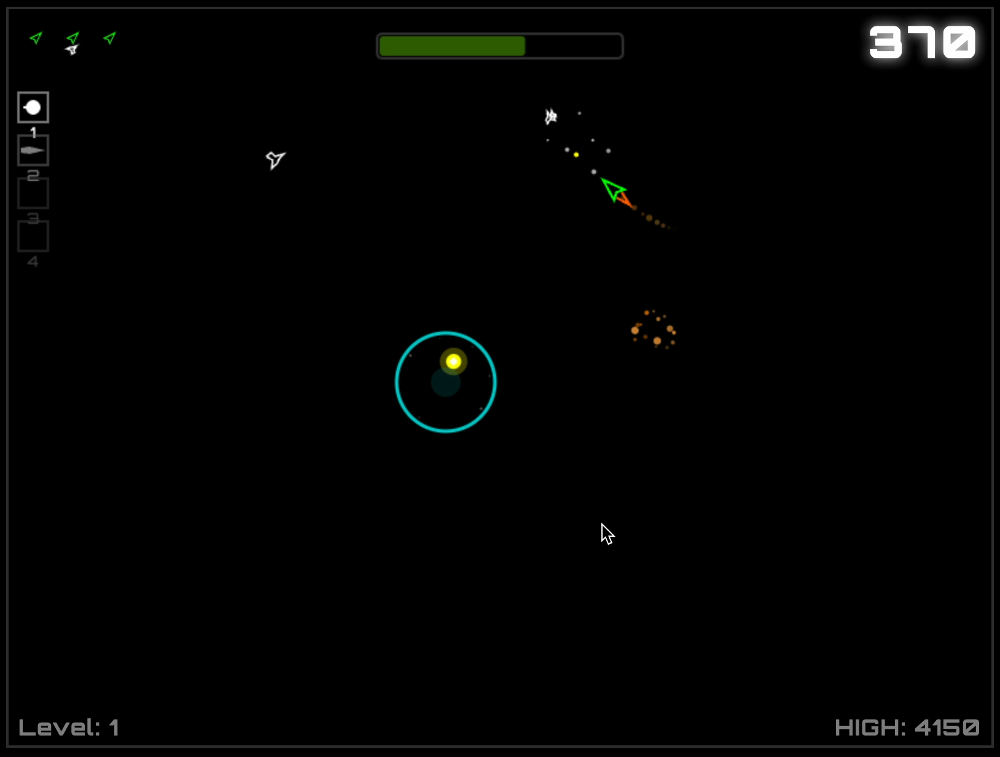

# Blasteroids

A web-based Asteroids-style game built with TypeScript and HTML5 Canvas.



## Development

### Prerequisites

- Node.js (v16 or higher)
- npm

### Getting Started

```bash
# Install dependencies
npm install

# Start development server
npm run dev

# Build for production
npm run build

# Preview production build
npm run preview

# Lint and format code
npm run lint:fix
```

## Tech Stack

- **TypeScript 5.7** - Type-safe JavaScript
- **Vite 6.3** - Fast build tool and dev server
- **HTML5 Canvas** - 2D graphics rendering
- **ESLint + Prettier** - Code linting and formatting

## Game Features (Planned)

- Physics-based ship movement with thrust and momentum
- Procedurally generated asteroids that split when destroyed
- Multi-stage collision detection system
- Score tracking and lives system
- Retro vector graphics aesthetic
