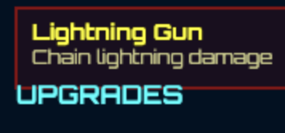
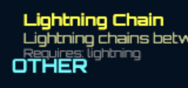
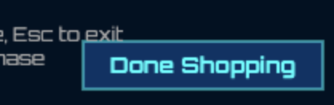
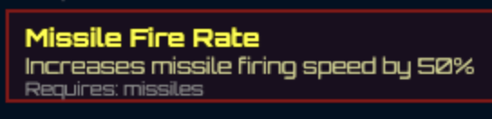

# Blasteroids Development TODO

### 🎨 Visual & Audio Polish

- [x] Visual elements that are currently rendered with DOM and CSS should
      instead be rendered in HTMLCanvas. This will facilitate taking screenshots
      that involve the entire UI.

### 🕹️ Game Mechanic Polish

- [x] Missiles and pea shooter bullets currently behave differently when fired:
      pea shooter bullets go perfectly straight (as confirmed by turning on the
      debug graphics). Missiles do not stay on that line, as though they are
      experiencing friction differently. Missiles should behave more like pea
      shooter bullets.

### 🎮 Gameplay Features

- [x] Screenshot keyboard shortcut: defaults to T
- [x] Merchant store in Zone Complete UI
    - [x] You can buy upgrades (which are gifts, but you pay for them so we
          can't call them gifts here)
    - [x] Merchant UI is a modal on top of the the Zone Complete screen
    - [x] Also entirely done in HTML Canvas
    - [x] Spend Credits. Can not go below zero (no credit cards here)
    - [x] Includes new weapons, weapon upgrades and extra lives
    - [x] Does not include AI companion because that requires position info at
          collection time and there is no way to deploy it
    - [x] Shows you a list of all the available weapons and their
          dependencies (tech tree graph moved to future enhancement)
    - [x] Two ways to interact:
        - [x] Keyboard keys to select
            - [x] Space to purchase
            - [x] Escape or Enter to exit
        - [x] Mouse
            - [x] Single click to select
            - [x] Double click to purchase
            - [x] Click "Done Shopping" button to exit

### 🔧 Technical Improvements

#### Code Quality & Testing

- [x] Fix failing ESLint issues in test files
    - [x] Replace `any` types with proper TypeScript type definitions
    - [x] Fix console.log statements in debug functions

#### Physics Testing Foundation (for future gravity system)

- [ ] Add physics unit tests as foundation for future gravity system refactor
- [ ] Create baseline physics behavior tests (ship movement, bullet inheritance, collision)
- [ ] Add performance benchmarks for physics calculations with many entities

#### General

- [ ] Performance optimizations for large numbers of objects

## Big New Features

### 🛠️ Development & Testing Tools

- [x] Escape Menu ✨
    - [x] Added merchant store access for debugging without completing levels
    - [x] Fixed merchant store button activation and keyboard navigation
    - [x] Implemented proper scrolling and item selection
    - [ ] Debugging option to add +50 credits, one per click

### 🎨 UI Enhancements

- [ ] Merchant Store Tech Tree Graph Visualization
    - [ ] Convert list-based merchant UI to interactive tech tree graph
    - [ ] Canvas-based node positioning with dependency connection lines
    - [ ] 2D mouse interaction for clicking nodes at arbitrary positions
    - [ ] Visual layout algorithms to prevent overlapping nodes
    - [ ] Animated connection lines showing upgrade paths

## Known Bugs

- [x] In Merchant UI. For all of these, please consult the  as to what it should look like. The emojis, text, and colors are mostly right. Please use existing colors from the codebase that are close to what the mock has.
    - [x] Text spacing issues   The items should only use two lines of text and items should be separated by a gap to support legibility
    - [x] Text overlapping the Done Shopping button. Make sure the help text to the left of the button is constrained horizontally and does not overlap button. 
    - [x] Item tiles should only use two lines of text, but this one uses three. 
    - [x] Prices should be listed with the currency symbol, not the textual name. 
    - [x] Also on  the 'insufficient spacebucks' should match the mock
